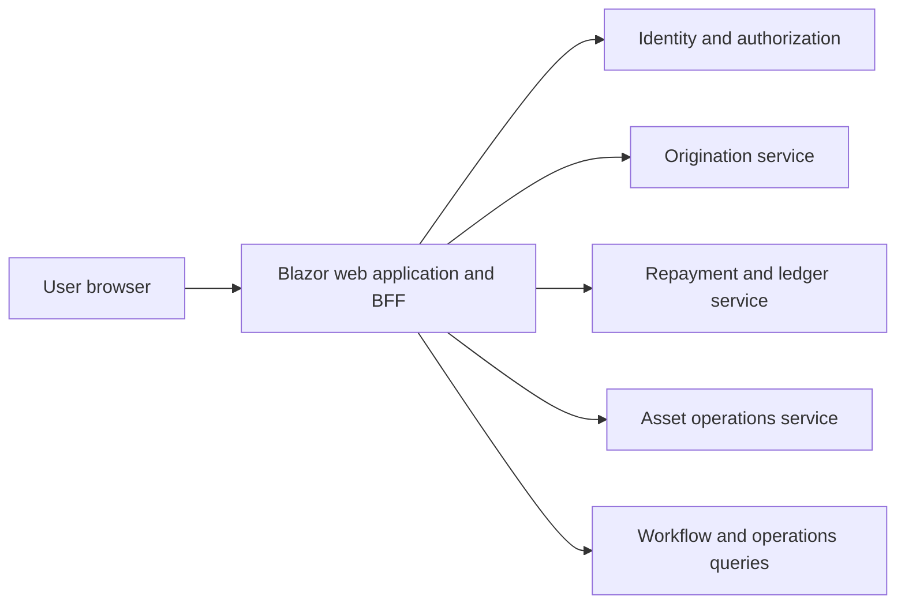
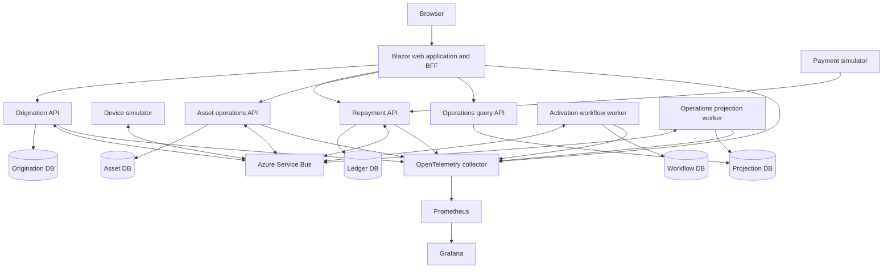

# System Architecture

## Why this system exists

Mobility Finance Event Platform demonstrates how a senior backend engineer can own a distributed financial system from domain design through deployment, monitoring, recovery, and decommissioning.

The system combines the concerns that must work together in a credible mobility-finance platform:

- financing origination and versioned pricing;
- exact repayment accounting;
- long-running activation workflows;
- financed-asset assignment and servicing;
- simulated device communication;
- operator review and audit;
- reliable asynchronous delivery;
- security, observability, delivery, and recovery.

Keeping these capabilities in one system is deliberate. Separate demonstration repositories could show each technology in isolation, but they would not prove that boundaries, events, permissions, operations, and failure handling work together.

## Product boundary

The platform models synthetic financing and operation of income-generating electric motorbikes:

1. An operator submits a financing application.
2. A versioned pricing policy produces an offer and repayment schedule.
3. Offer acceptance creates an agreement awaiting its initial deposit.
4. A simulated provider posts payment events.
5. An immutable double-entry ledger allocates repayments and derives balances.
6. An available motorbike is assigned and the agreement is activated.
7. A device simulator publishes operational heartbeats without personal location data.
8. Authorized operators request and review simulated device commands.
9. Operations staff inspect workflows, audit records, dead letters, service health, and traces.

Missed payments never trigger an automatic restrictive command. They create a review case. A simulated restrictive command requires an authorized reviewer, an explicit reason, and an immutable audit record.

The repository contains no real customer, credit, payment, vehicle, or location data. It does not make real lending decisions or communicate with production hardware.

## One web application

All user-facing functionality is delivered through one authenticated web application:



The BFF is the only browser-facing application endpoint. Internal services are not exposed directly to the browser. The BFF:

- authenticates the user;
- enforces role and policy checks;
- protects browser sessions and state-changing requests;
- calls internal APIs with service credentials;
- returns UI-specific projections rather than internal domain models;
- propagates correlation and trace context.

### Roles

The initial role model is intentionally small:

| Role | Responsibilities |
| --- | --- |
| `operator` | Create applications, inspect agreements, record permitted servicing activity |
| `reviewer` | Resolve manual-review cases and approve sensitive simulated commands |
| `platform-admin` | Inspect delivery failures, operate replay controls, and manage platform configuration |

Permissions are policy based. UI visibility is not treated as authorization; every protected server operation enforces its policy independently.

Local development uses seeded synthetic identities. The cloud design uses standards-based OIDC, managed identities for workloads, and secrets stored outside source control.

## Deployable components

### Web application and BFF

The Blazor web application provides:

- login and logout;
- role-aware navigation;
- origination and offer workflows;
- repayment, balance, and ledger views;
- asset inventory and assignment;
- workflow timelines and manual-review queues;
- simulated command approval;
- dead-letter summaries and controlled replay;
- service health, SLO, dashboard, and trace links.

The UI supports the backend evidence; it does not duplicate business rules owned by services.

### Origination service

The origination service owns:

- financing applications;
- immutable pricing-policy versions;
- priced offers;
- repayment schedule snapshots;
- offer acceptance;
- agreement creation and state transitions.

It demonstrates ASP.NET Core API design, domain modeling, validation, persistence, optimistic concurrency, and reliable event publication.

### Repayment and ledger service

The repayment service owns:

- authenticated, bounded payment callback ingestion;
- provider-event idempotency;
- immutable double-entry postings;
- repayment allocation;
- reversals through compensating entries;
- balances, arrears projections, and ledger queries.

Money uses explicit currency and decimal minor-unit rules. Every transaction must balance before it can be committed. Existing entries are never edited to correct financial history.

### Asset operations service

The asset service owns:

- motorbike inventory;
- agreement-to-asset assignments;
- servicing and warranty state;
- simulated device registration and heartbeat state;
- command requests, approvals, dispatch, and results;
- append-only command audit history.

The deterministic device simulator produces successful, delayed, duplicated, out-of-order, and failed responses. No real hardware integration is included.

### Activation workflow worker

The workflow worker coordinates:

```text
OfferAccepted -> DepositRecorded -> AssetAssigned -> AgreementActivated
```

Workflow state is persisted. Timeouts and compensations are explicit. Unresolved cases become review work rather than disappearing or retrying forever. The workflow does not rely on distributed database transactions.

### Payment provider simulator

The simulator generates signed synthetic callbacks and supports:

- accepted and rejected payments;
- duplicate delivery;
- delayed and out-of-order delivery;
- reversals;
- invalid authentication;
- malformed and oversized payloads.

It exists to make financial and messaging failure paths reproducible without external credentials.

## Event-driven integration

Azure Service Bus topics carry facts that multiple consumers may need. Queues carry directed commands.

Representative events include:

- `ApplicationSubmitted`
- `OfferPriced`
- `OfferAccepted`
- `AgreementCreated`
- `DepositRecorded`
- `AssetAssigned`
- `AgreementActivated`
- `PaymentRecorded`
- `RepaymentAllocated`
- `AccountReviewRequired`
- `DeviceHeartbeatReceived`
- `DeviceCommandCompleted`

Every message contains:

- stable message ID;
- event type and schema version;
- causation and correlation IDs;
- aggregate ID and sequence;
- UTC occurrence timestamp;
- distributed trace context;
- synthetic market and tenant identifiers.

### Delivery guarantees

The system assumes at-least-once delivery. Correctness comes from:

- a transactional outbox for business state and publication intent;
- a persistent inbox for consumer deduplication;
- idempotency keyed by stable message ID, not correlation ID;
- ordered sessions for agreement or asset streams that require ordering;
- optimistic concurrency and expected aggregate sequence checks;
- bounded retries with jitter;
- poison-message dead-lettering;
- explicit, authorized, audited replay;
- versioned event contracts and compatibility tests.

The local environment uses Microsoft's containerized Azure Service Bus emulator. Emulator state is disposable and not all Azure capabilities are reproduced locally, so cloud-only behavior is identified separately rather than implied.

## Data ownership

Each service is the sole writer for its data:

| Service | Owned data |
| --- | --- |
| Origination | applications, pricing snapshots, offers, schedules, agreements |
| Ledger | accounts, entries, allocations, provider events, reversals |
| Assets | inventory, assignments, servicing, heartbeats, commands |
| Workflow | instances, steps, deadlines, compensations, review cases |
| Identity | local synthetic users, roles, sessions, security audit |

Local development uses one PostgreSQL container with isolated databases. Services do not join across databases or share persistence models.

The web application reads service APIs and disposable event-built projections. A projection is never the source of truth for a command.

## Runtime topology



## Technology choices

- .NET 10 LTS and C#
- ASP.NET Core APIs and hosted workers
- Blazor for the unified web application
- Entity Framework Core and PostgreSQL
- Azure Service Bus and its local emulator
- Docker and Docker Compose
- Kubernetes and Helm
- AKS as the documented cloud target
- Bicep for Azure infrastructure
- Azure Container Registry
- Azure Key Vault and workload identity in the cloud design
- OpenTelemetry for logs, metrics, and traces
- Prometheus and Grafana
- xUnit and container-based integration tests

.NET 10 is selected because it is the current long-term support release. Dependencies are pinned, reviewed, and updated through explicit changes.

## One-command startup

The repository provides:

```bash
make app-start
```

The command builds and starts:

- the web application and BFF;
- all APIs and workers;
- PostgreSQL;
- Azure Service Bus emulator;
- payment and device simulators;
- OpenTelemetry collector;
- Prometheus;
- Grafana.

Startup includes dependency health checks and deterministic seed data. `make app-status`, `make app-logs`, and `make app-stop` provide the matching operational controls.

## Observability

OpenTelemetry propagates context through HTTP and Service Bus. The platform records:

- request rate, error rate, and latency;
- message age, retry count, processing duration, and dead-letter count;
- workflow completion, compensation, and timeout counts;
- payment ingestion and allocation lag;
- ledger invariant failures;
- heartbeat age and simulated command latency;
- authentication failures and authorization denials;
- business-safe structured logs without secrets or personal data.

Grafana dashboards present service health and business workflows. Alerts link to runbooks. A user can move from an agreement or workflow in the web application to its correlated trace.

SLO values are documented as design targets until measured in a running environment.

## Security and safety

The platform includes:

- OIDC-compatible authentication;
- policy-based RBAC;
- secure browser sessions;
- CSRF protection for browser mutations;
- service identity and least privilege;
- dual-control approval for sensitive simulated commands;
- callback authentication and replay protection;
- bounded request bodies and rate limiting;
- no secrets in source, images, logs, traces, or fixtures;
- immutable audit records for pricing, manual decisions, replay, and commands;
- dependency, image, secret, and infrastructure scanning;
- a threat model for forged callbacks, duplicate delivery, privilege escalation, poisoned messages, and data leakage.

## Azure infrastructure

Bicep modules define:

- networking and private subnets;
- AKS;
- Azure Container Registry;
- Azure Service Bus;
- PostgreSQL Flexible Server;
- Key Vault;
- Azure Monitor workspace;
- managed Prometheus;
- managed Grafana;
- workload identities and least-privilege role assignments;
- diagnostic settings and retention.

Helm charts define application deployments, health probes, resources, disruption budgets, autoscaling where justified, network policies, and workload-identity integration.

Infrastructure definitions can be linted and validated without provisioning. The project only claims a cloud deployment after the deployed resources and user journeys have been verified.

## Testing and engineering evidence

The test strategy includes:

- domain and application unit tests;
- property tests for ledger balancing and allocation;
- architecture tests for dependency boundaries;
- database and messaging integration tests;
- contract tests for APIs and versioned events;
- authorization matrix tests;
- complete application, payment, activation, reversal, review, and command journeys;
- duplicate, delayed, out-of-order, and poison-message delivery;
- consumer failure after commit but before acknowledgement;
- database and broker interruption;
- dead-letter containment and replay;
- rolling upgrade and rollback;
- backup and restore;
- load tests with published hardware and parameters.

Benchmarks distinguish measured local results from unverified production targets.

## Delivery sequence

1. Establish the .NET solution, repository standards, architecture, and local runtime.
2. Build authentication, RBAC, the BFF, and the web shell.
3. Implement origination and versioned pricing.
4. Implement payment ingestion and the double-entry ledger.
5. Add Service Bus delivery, outbox/inbox, and activation workflows.
6. Add asset operations and deterministic device simulation.
7. Add observability, security controls, and recovery exercises.
8. Add Kubernetes, Bicep, and delivery automation.
9. Run complete quality, security, runtime, and authorship verification.

Each commit represents a meaningful, working increment. Commits are authored and committed as Steven Ongati and pushed directly to `main`.

## Definition of done

A reviewer can:

1. start the complete system with one documented command;
2. sign in and use role-appropriate workflows through one web application;
3. execute application, deposit, activation, repayment, reversal, review, and simulated command journeys;
4. observe traces and dashboards across HTTP and asynchronous boundaries;
5. reproduce duplicate, delayed, out-of-order, poison-message, outage, and recovery scenarios;
6. verify ledger, idempotency, authorization, and audit invariants through tests;
7. validate containers, Helm, Kubernetes, and Bicep;
8. inspect ADRs, threat models, SLOs, runbooks, benchmark methods, and recovery evidence;
9. distinguish tested local behavior, validated infrastructure definitions, and genuinely deployed cloud behavior.

## Public references

- M-KOPA Senior Backend Engineer job description supplied for portfolio analysis
- https://www.m-kopa.com/mobility
- https://www.m-kopa.com/about
- https://jobs.ashbyhq.com/m-kopa/0c398bf1-8bb1-44c6-81c9-b884e300db4b
- https://learn.microsoft.com/en-us/dotnet/core/releases-and-support
- https://learn.microsoft.com/en-us/azure/service-bus-messaging/overview-emulator
- https://learn.microsoft.com/en-us/azure/architecture/patterns/idempotent-consumer
- https://learn.microsoft.com/en-us/azure/architecture/reference-architectures/containers/aks/baseline-aks
- https://learn.microsoft.com/en-us/dotnet/core/diagnostics/observability-with-otel
